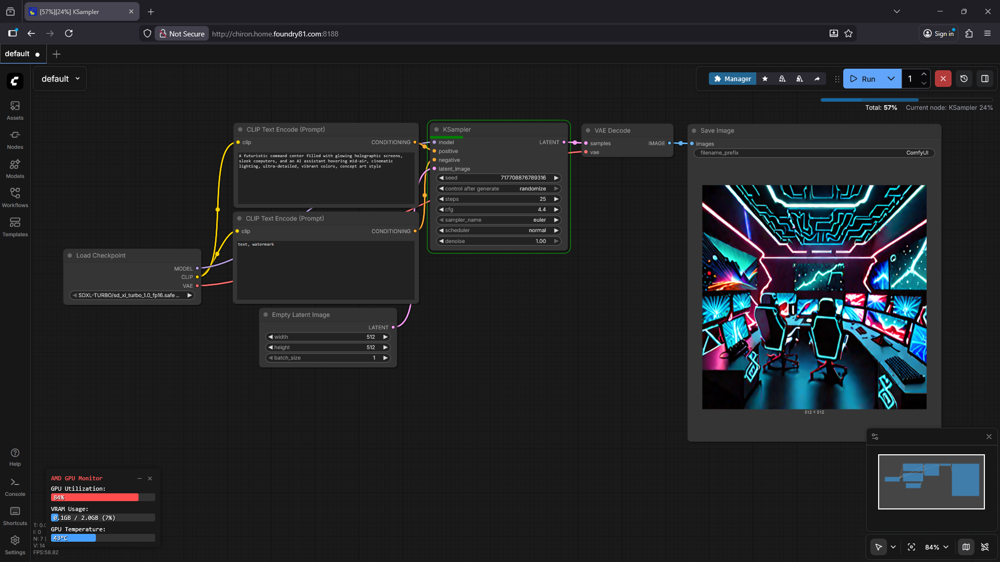

# ComfyUI ROCm Docker
A persistent Docker setup for ComfyUI with ROCm (AMD GPU) support, including a small test model for immediate use. Tested on the Minisforum N5 Pro and should also work on similar AMD-based systems such as the AI X1 Pro.



This repository includes:
- `Dockerfile` - builds a ROCm-enabled ComfyUI image with Python dependencies and a small test SD model.
- `docker-compose.yml` - aimplifies container startup with GPU access, bind mounts, and healthchecks.


## Features
- Runs ComfyUI on AMD GPUs using ROCm
- Includes a persistent directory structure for models, outputs, inputs, and custom nodes
- Pre-downloads a small Stable Diffusion 1.5 test model
- Exposes web UI on port 8188
- Healthcheck ensures the UI is responding
- Compatible with Minisforum N5 Pro, AI X1 Pro, and other ROCm-enabled AMD systems


## Requirements
- Docker >= 24.x
- Docker Compose >= 2.12.x
- AMD GPU with ROCm drivers installed on host
- Linux host (Ubuntu-based or TrueNAS SCALE recommended)


## Setup
### Build Docker Image

```bash
docker build -t comfyui-rocm-n5pro .
```

This will:
- Install system and Python dependencies
- Clone ComfyUI v0.9.1
- Create required directories (`models`, `output`, `input`, `custom_nodes`)
- Install Python dependencies for ComfyUI
- Download a small test SD model for immediate use

### Start Container with Docker Compose

```bash
docker-compose up -d
```

This uses the prebuilt image (comfyui-basic2) and:
- Maps GPU devices (/dev/kfd and /dev/dri) for ROCm
- Mounts host directories for persistence
- Exposes the UI on http://localhost:8188
- Automatically restarts the container unless stopped

### Usage
Access the ComfyUI Web UI:
```
http://<host-ip>:8188
```

- Test image generation with the pre-downloaded SD 1.5 model.
- Add your own models to `./models` (mapped to `/workspace/ComfyUI/models in the container`).
- Custom nodes can be placed in `/mnt/Storage/apps/comfy3/custom_nodes`.

### Directory Structure and Bind Mounts
| Host Directory  | Container Directory | Purpose  |
|---|---|---|
| `/mnt/Storage/apps/comfy3/models`  | `/workspace/ComfyUI/models`  | Model storage (checkpoints, VAE, LoRAs, etc.)  |
| `/mnt/Storage/apps/comfy3/output`  | `/workspace/ComfyUI/output`  | Generated outputs  |
| `/mnt/Storage/apps/comfy3/input`  | `/workspace/ComfyUI/input`  | Input files for workflows  |
| `/mnt/Storage/apps/comfy3/custom_nodes`  | `/workspace/ComfyUI/custom_nodes`  | Custom node extensions  |

### Health Checks
The container is configured with a healthcheck that verifies the ComfyUI Web UI is responding every 30 seconds. If it fails 3 times in a row, Docker will mark the container as unhealthy.


## Notes & Caveats
- Tested and confirmed working on Minisforum N5 Pro; likely compatible with AI X1 Pro or other AMD ROCm setups.
- A small test SD 1.5 model is downloaded by default. Add larger models as needed.
- ROCm runtime does not need to be specified in Compose; devices are exposed directly via `/dev/kfd` and `/dev/dri`.
- Shared memory (`shm_size`) is set to 16GB to improve performance on large models.


## Acknowledgements
This project was made possible by [Minisforum](https://minisforum.com), who sent over an N5 Pro demo in summer 2025. At first, the system sat on the shelf - a few trade-offs and rough edges kept it there longer than expected.

With time, updates, and a fresh approach - running TrueNAS on bare metal - the N5 Pro revealed its potential as a compact AI powerhouse. GPU support now shines, and the system can really stretch its legs.

While the N5 Pro might not have hit every milestone its creators hoped for, it’s a testament to Minisforum’s willingness to experiment. Their boldness gives users the chance to explore, push boundaries, and find new ways to work with technology.


## License
This repository is released under the MIT License.