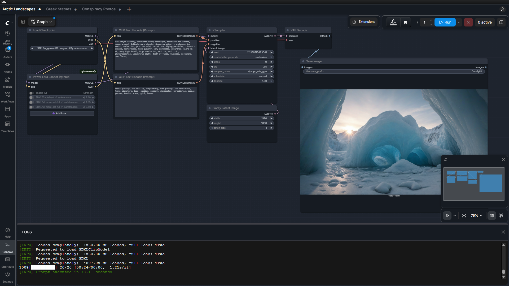

# ComfyUI ROCm Docker - Minisforum N5 Pro

A Docker-based ComfyUI environment running on AMD ROCm, built specifically around the **Minisforum N5 Pro** and its **AMD Ryzen AI 9 HX PRO 370 / Radeon 890M** integrated GPU.

The current `main` branch uses **ROCm 10.0 and PyTorch 2.13** and has been tested successfully for Stable Diffusion image generation and LoRA loading on a TrueNAS SCALE host.



## Hardware

Primary test platform:

| Component         | Specification               |
| ----------------- | --------------------------- |
| System            | Minisforum N5 Pro           |
| CPU               | AMD Ryzen AI 9 HX PRO 370   |
| GPU               | AMD Radeon 890M             |
| GPU architecture  | `gfx1150`                   |
| GPU memory        | ~64 GB shared system memory |
| Host OS           | TrueNAS SCALE               |
| Host kernel       | Linux 6.12.x                |
| Container runtime | Docker / Docker Compose     |

The Radeon 890M is an integrated GPU, so the memory reported by ROCm is shared system memory rather than dedicated VRAM.     

## Software Stack

The current `main` branch uses:

| Component  | Version                                                           |
| ---------- | ----------------------------------------------------------------- |
| Base image | `rocm/pytorch:rocm10.0_ubuntu24.04_py3.13_pytorch_release_2.13.0` |
| ROCm       | 10.0                                                              |
| PyTorch    | 2.13.0                                                            |
| Python     | 3.13                                                              |
| GPU target | `gfx1150`                                                         |
| ComfyUI    | Current version at image build time                               |

The ROCm 10 stack provides native `gfx1150` support for the Radeon 890M; no `HSA_OVERRIDE_GFX_VERSION` workaround is required.

## Repository Structure

The repository contains the files required to build and run the environment:

* `Dockerfile` - builds the ComfyUI image using AMD's ROCm/PyTorch 10.0 base image.
* `compose.yml` - starts the container with AMD GPU access, persistent storage, healthchecks, and the required runtime configuration.
* `readme-assets/` - documentation images.

## Building the Image

Build the image with Docker Compose:

```bash
docker compose build
```

For a completely clean rebuild:

```bash
docker compose build --no-cache
```

The ROCm base image is large. A clean build downloads a substantial ROCm/PyTorch runtime layer, so the initial build may take several minutes and consume significant local Docker storage.

## Starting ComfyUI

Start the container:

```bash
docker compose up -d
```

Check its status:

```bash
docker compose ps
```

View the logs:

```bash
docker compose logs -f
```

The included healthcheck verifies that the ComfyUI HTTP interface is responding.

## Accessing ComfyUI

The default Compose configuration maps the container's port 8188 to host port **8188**:

```text
http://<host-ip>:8188
```


## GPU Configuration

The container is given direct access to the AMD GPU through:

```yaml
devices:
  - /dev/kfd:/dev/kfd
  - /dev/dri:/dev/dri
```

The container also joins the `video` group and uses an unrestricted seccomp profile required by the ROCm runtime.

The Compose configuration limits the visible accelerator to GPU 0:

```yaml
environment:
  HIP_VISIBLE_DEVICES: "0"
```

For this system, ROCm identifies the Radeon 890M as:

```text
AMD Radeon 890M Graphics
gfx1150
```

### No GFX Override Required

This configuration intentionally does **not** use:

```text
HSA_OVERRIDE_GFX_VERSION
```

The Radeon 890M is natively supported by the ROCm 10 stack used here.

## Persistent Storage

Models, generated images, inputs, custom nodes, and ComfyUI user configuration are stored outside the container.

The default configuration uses:

| Host Directory                           | Container Directory               | Purpose                                |    
| ---------------------------------------- | --------------------------------- | -------------------------------------- |    
| `/mnt/Storage/apps/comfyui/models`       | `/workspace/ComfyUI/models`       | Models, checkpoints, VAEs, LoRAs, etc. |    
| `/mnt/Storage/apps/comfyui/output`       | `/workspace/ComfyUI/output`       | Generated images                       |    
| `/mnt/Storage/apps/comfyui/input`        | `/workspace/ComfyUI/input`        | Input files                            |    
| `/mnt/Storage/apps/comfyui/custom_nodes` | `/workspace/ComfyUI/custom_nodes` | Custom node extensions                 |    
| `/mnt/Storage/apps/comfyui/user`         | `/workspace/ComfyUI/user`         | ComfyUI user configuration             |    

Because these directories are bind-mounted, rebuilding or replacing the Docker image does not remove models or user data.    

## Memory and Performance

The container is configured with:

```yaml
shm_size: 16g
```

This provides a large shared-memory area for ComfyUI and its dependencies.

The container also starts ComfyUI with:

```text
--gpu-only
--force-fp16
```

The N5 Pro's Radeon 890M exposes approximately 30 GB of GPU-visible memory through ROCm, although this is shared system memory.

## Validation

The ROCm 10 environment has been validated through the following progression:

1. PyTorch detects the Radeon 890M.
2. ROCm identifies the GPU as `gfx1150`.
3. ComfyUI starts successfully.
4. Stable Diffusion models load onto the GPU.
5. Stable Diffusion image generation works.
6. LoRAs load and function correctly.
7. The same workloads were observed to perform faster than the previous ROCm 7.x environment.

A useful low-level validation test is:

```bash
docker compose run --rm \
  --entrypoint /opt/venv/bin/python \
  comfyui -c "
import torch

print('Torch:', torch.__version__)
print('HIP:', torch.version.hip)
print('Device:', torch.cuda.get_device_name(0))

x = torch.randn((1024, 1024), dtype=torch.float32)
print('CPU tensor created')

y = x.to('cuda')
torch.cuda.synchronize()

print('CPU -> GPU transfer: SUCCESS')
print('GPU tensor:', y.device)
print('GPU memory:', torch.cuda.memory_allocated() / 1024**2, 'MB')
"
```

A successful result confirms that the basic CPU-to-GPU memory path is functional before troubleshooting ComfyUI itself.      

## ROCm 7.x Legacy Configuration

The previous ROCm 7.x implementation is preserved in the repository's **rocm7.2.1 branch**.

The branch exists primarily as a known-good fallback and historical reference for the previous environment.

The `main` branch is now the ROCm 10 implementation.

## Why This Repository Exists

This project started as an experiment to get ComfyUI running efficiently on the N5 Pro's integrated Radeon 890M GPU. The system is an unusual target for containerized AI workloads: unlike a conventional discrete GPU, the 890M uses shared system memor     ry. The goal is therefore not to present this as a universal AMD GPU configuration, but to document a working, reproducible se     etup for this particular class of AMD APU.

The configuration deliberately keeps the ROCm/PyTorch runtime inside the container while exposing only the required GPU device interfaces from the TrueNAS host. That makes it possible to update the AI software stack independently from the host operat     ting system while retaining persistent models and ComfyUI configuration.

## Troubleshooting

### Check container logs

```bash
docker compose logs -f
```

### Check GPU visibility

```bash
docker compose run --rm \
  --entrypoint /opt/venv/bin/python \
  comfyui -c "
import torch
print(torch.__version__)
print(torch.version.hip)
print(torch.cuda.is_available())
print(torch.cuda.get_device_name(0))
"
```

Expected output should identify:

```text
AMD Radeon 890M Graphics
```

and:

```text
gfx1150
```

### Check the host GPU devices

On the TrueNAS host:

```bash
ls -l /dev/kfd
ls -l /dev/dri/renderD*
```

The Docker container requires access to `/dev/kfd` and the AMD render device.

### Rebuild after Dockerfile changes

```bash
docker compose down
docker compose build --no-cache
docker compose up -d
```

Persistent models, outputs, inputs, custom nodes, and user configuration remain in the host bind mounts.

## Optional: Increase AMD GTT Memory

APUs such as the Ryzen AI 9 HX PRO 370 do not have conventional dedicated VRAM. ROCm uses shared system memory through the GPU's GTT/TTM infrastructure.

On a 60 GiB system, the default TTM limit observed with TrueNAS 25.10 was approximately 30.2 GiB. This can be increased by setting the Linux kernel parameter `ttm.pages_limit`.

This repository includes an optional script to increase the limit to 48 GiB:

```bash
./scripts/set-ttm-48gb.sh
```

A reboot is required.

This is an advanced configuration. Increasing the GPU's available GTT memory reduces the amount of system RAM available to TrueNAS, ZFS, containers, and other applications. Do not use this setting blindly on systems with limited RAM.

To restore the default configuration:

```bash
./scripts/restore-ttm-default.sh
```

After rebooting, verify the configuration with:

```bash
cat /sys/module/ttm/parameters/pages_limit
cat /sys/class/drm/card0/device/mem_info_gtt_total
```

## Acknowledgements

This project was made possible by [Minisforum](http://minisforum.com), who provided an N5 Pro demo system in summer 2025.    

The N5 Pro initially spent considerably more time sitting on a shelf than generating images. Improvements in the software stack, ROCm support, and a bare-metal TrueNAS configuration eventually turned it into a surprisingly capable compact AI workstat     tion.

## License

This project is released under the MIT License.

